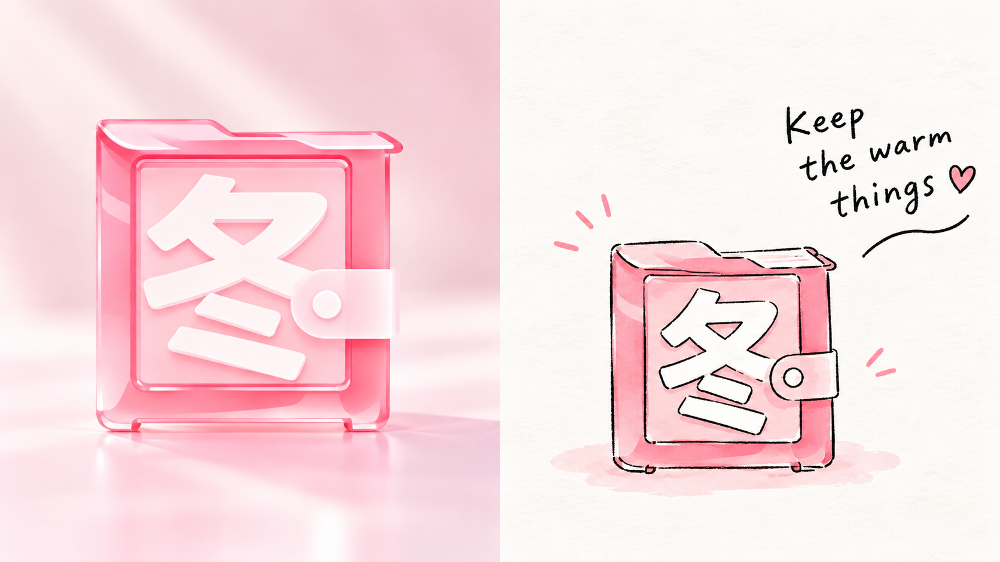
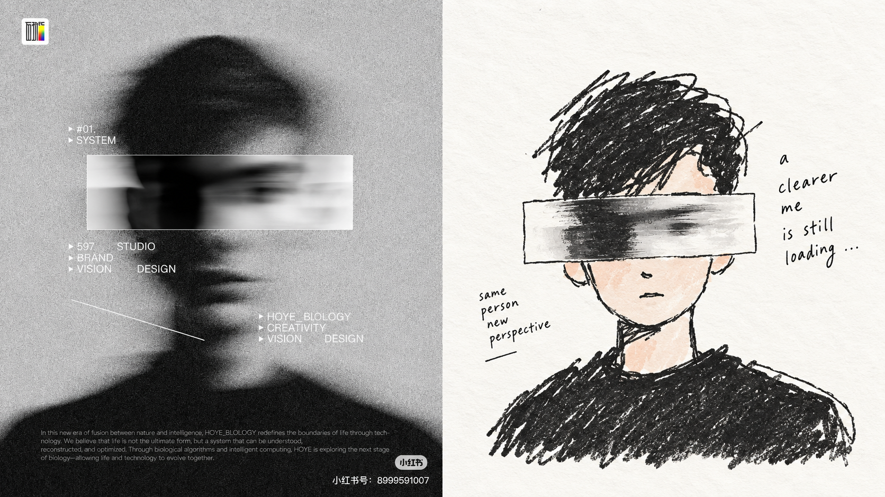
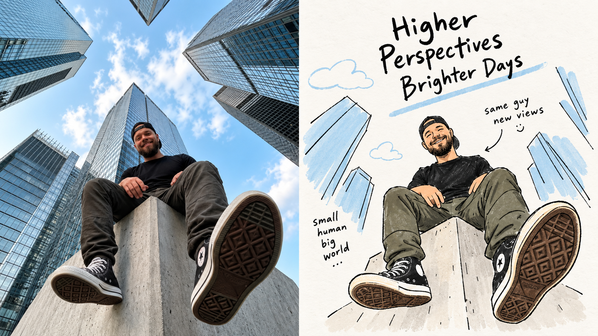
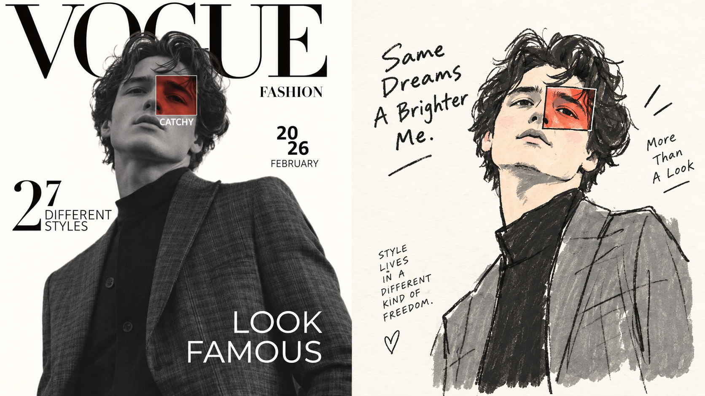
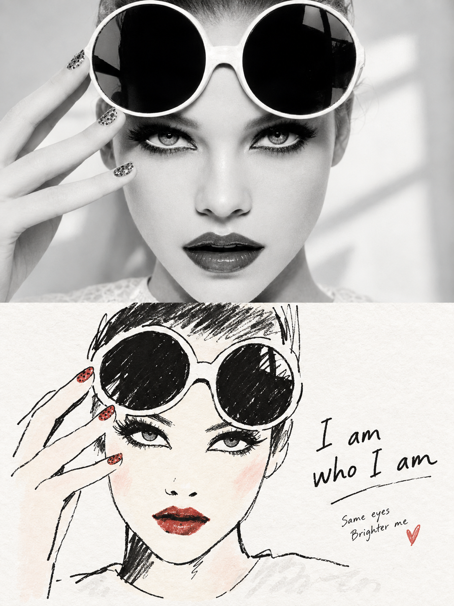
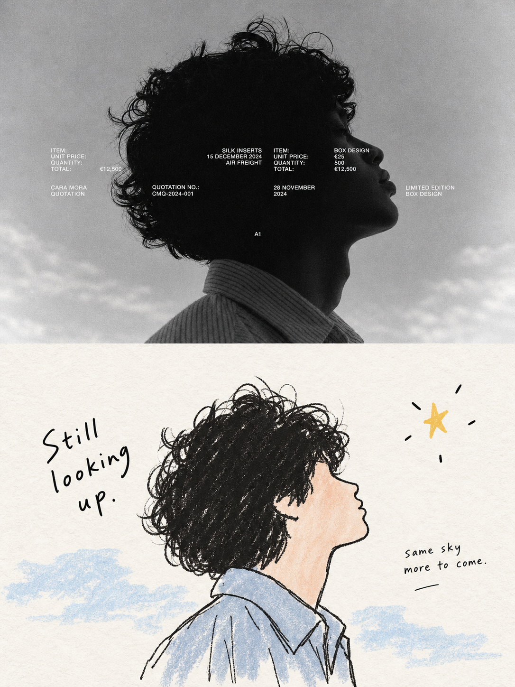
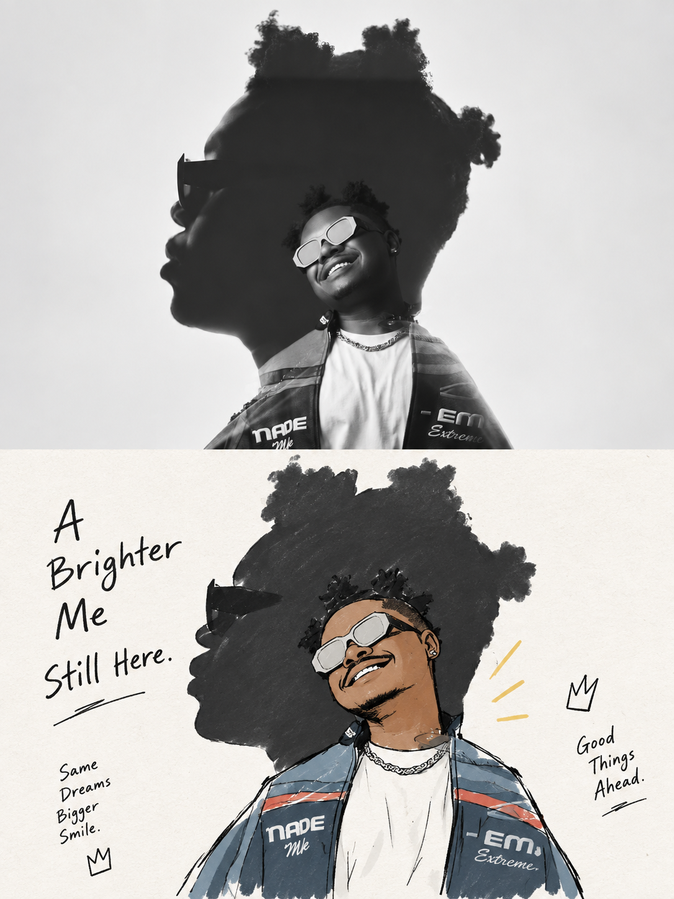
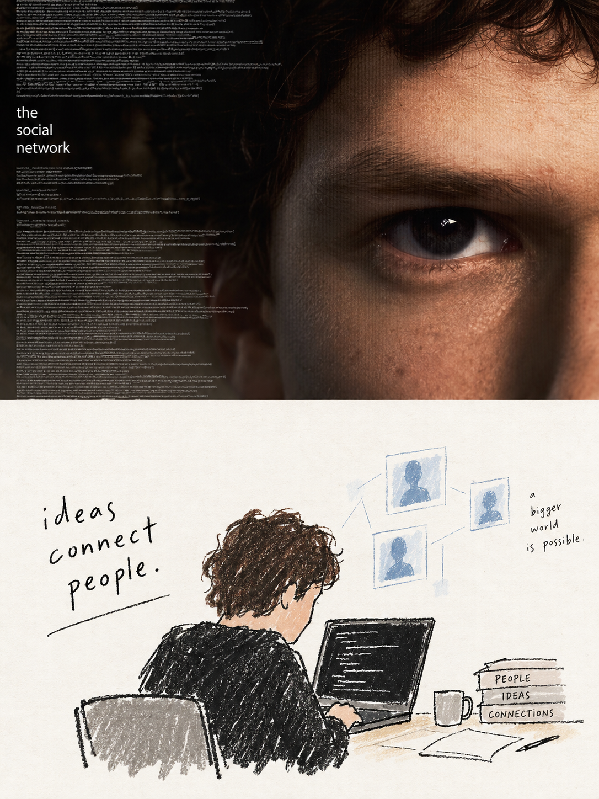

# 🦁 XXD Panel 066

### 用松弛黑线和柔和平涂讲述童真而克制的照片故事

<a href="README.md">简体中文</a> · <a href="README.en.md">English</a> · <a href="README.ja.md">日本語</a> · <a href="README.ko.md">한국어</a> · <a href="README.ar.md">العربية</a>

Panel 066 保留照片中最值得记住的主体关系和少量环境线索，用略显笨拙的黑线、3–6 种柔和色块与手写观察句，形成经过专业编辑的随手画。

**关键词：** 童真叙事 · 笨拙黑线 · 柔和平涂 · 治愈色彩 · 手写观察

## 使用

```text
/xxd-panel-066 photo.jpg --mode design-only --size 3:4 --text prompt --locale zh-CN
```

支持单图、目录批量、四种输出模式、多尺寸与三种文字模式。完整行为见 [SKILL.md](SKILL.md)。

## 原始提示词 · 五种语言

[打开统一的多语言目录](references/original-prompt/)：[简体中文原文](references/original-prompt/zh-CN.md) · [English](references/original-prompt/en.md) · [日本語](references/original-prompt/ja.md) · [한국어](references/original-prompt/ko.md) · [العربية](references/original-prompt/ar.md)

简体中文文件保存用户提供的逐字原文，并且是运行时唯一创作与审美权威；其他四个版本是忠实的阅读译文，方便国际读者理解和转发，不会反过来改写生图提示词。

当前尚未提供原始 X 样张或出处，`sample-01`–`04` 因此保留。下面的新增样张均有明确内容源映射，详见[样张清单](assets/examples/README.md)。

## 新增 16:9 左右双联样张

| | |
|---|---|
|  |  |
|  |  |

## 新增 3:4 上下双联样张

| | |
|---|---|
|  |  |
|  |  |
